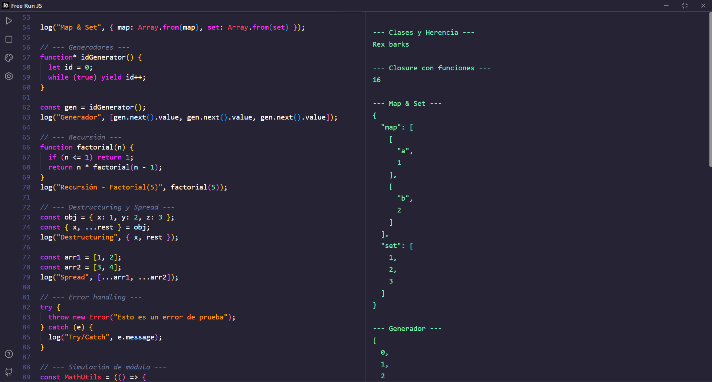
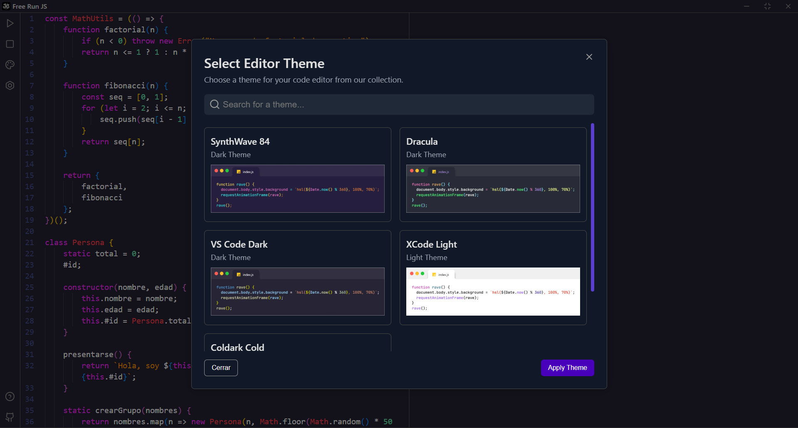

# Free Run JS ⚡


<p align="center">
  
</p>

<div align="center">
  
  <p><em>v2.0.0 Run JavaScript code instantly without complicated setup</em></p>
</div>

## ✨ Features

- **Instant execution** - Write and run JavaScript code with a single click
- **User customization** - Customize the editor to your liking
- **Split interface** - Editor and output console in the same window thanks to Split.js
- **No external dependencies** - Everything you need is included
- **Smart autocompletion** - Code suggestions as you type
- **Cross-platform** - Available for Windows, macOS, and Linux

## 🚀 Installation

### Direct download

Download the latest version from the [releases page](https://github.com/khyxer/free-run-js/releases).

### From source code

```bash
# Clone the repository
git clone https://github.com/khyxer/free-run-js.git

# Enter the directory
cd free-run-js

# Install dependencies
npm install

# Install on your device

# Windows
npm run build:wind

# Linux
npm run build:linux

# MacOS
npm run build:mac
```

Then check the Dist folder and run the installer `Free-Run-js-2.0.0.exe`

## 🛠️ Technologies

- **Electron** - Framework for creating desktop applications with web technologies
- **Electron-Vite** - Optimized build tool for Electron applications
- **Split.js** - Split and resizable interface
- **Monaco Editor** - Powerful code editor similar to VS Code
- **Node.js** - JavaScript runtime environment

## 💻 Usage

1. **Write** your JavaScript code in the top panel
2. **Run** your code runs automatically after a short delay
3. **View** look at the results in the console on the right

## 🌐 Website
[Official Website](https://freerunjs.vercel.app/)

## 📷 Screenshots

<div align="center">
  
  
</div>

## 🤝 Contributing

Contributions are welcome! Follow these steps:

1. Fork the repository
2. Create a branch for your feature (`git checkout -b feature/amazing-feature`)
3. Commit your changes (`git commit -m 'Add some amazing feature'`)
4. Push to the branch (`git push origin feature/amazing-feature`)
5. Open a Pull Request

## 📜 License

Distributed under the [MIT License](./LICENSE). See [`LICENSE`](./LICENSE) for more information.
