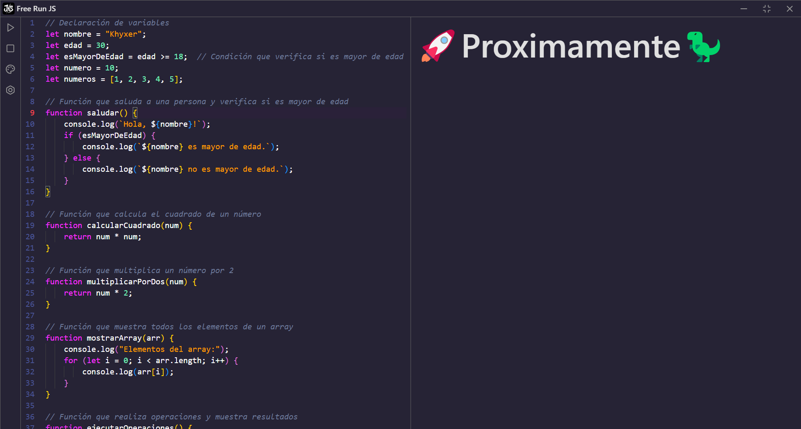

# Free Run JS ⚡


<div align="center">
  
  <p><em>V1.1.0 Run JavaScript code instantly without complicated setup</em></p>
</div>

## ✨ Features

- **Instant execution** - Write and run JavaScript code with a single click
- **Split interface** - Editor and output console in the same window thanks to Split.js
- **No external dependencies** - Everything you need is included

## 🚀✨ Thoughtful Features

- **Smart autocompletion** - Code suggestions as you type
- **Customizable themes** - Light/dark mode and more customization options
- **Code export** - Save your snippets for future use
- **Cross-platform** - Available for Windows, macOS, and Linux

## 🚀 Installation

### Direct download

Download the latest version from the [releases page](https://github.com/khyxer/free-run-js/releases).

### From source code

```bash
# Clone the repository
git clone https://github.com/khyxer/free-run-js.git

# Enter the directory
cd free-run-js

# Install dependencies
npm install

# Start the application
npm run dev
```

## 🛠️ Technologies

- **Electron** - Framework for creating desktop applications with web technologies
- **Electron-Vite** - Optimized build tool for Electron applications
- **Split.js** - Split and resizable interface
- **Monaco Editor** - Powerful code editor similar to VS Code
- **Node.js** - JavaScript runtime environment

## 💻 Usage

1. **Write** your JavaScript code in the top panel
2. **Run** with the execution button or using the shortcut `Ctrl+Enter` (or `Cmd+Enter` on macOS)
3. **View** results instantly in the bottom panel
4. **Save** your code snippets to .js files

## 📷 Screenshots

<div align="center">
  
</div>

## 🤝 Contributing

Contributions are welcome! Follow these steps:

1. Fork the repository
2. Create a branch for your feature (`git checkout -b feature/amazing-feature`)
3. Commit your changes (`git commit -m 'Add some amazing feature'`)
4. Push to the branch (`git push origin feature/amazing-feature`)
5. Open a Pull Request

## 📝 Development Notes

This project uses electron-vite for optimal development workflow:

- **Development**: `npm run dev`
- **Build**: `npm run build`
- **Package**: `npm run package`

## 📜 License

Distributed under the [MIT License](./LICENSE). See `LICENSE` for more information.

<div align="center">
  <p>Made by developers for developers</p>
  <p>Found a bug or have an idea? <a href="https://github.com/khyxer/free-run-js/issues">Open an issue</a></p>
</div>
